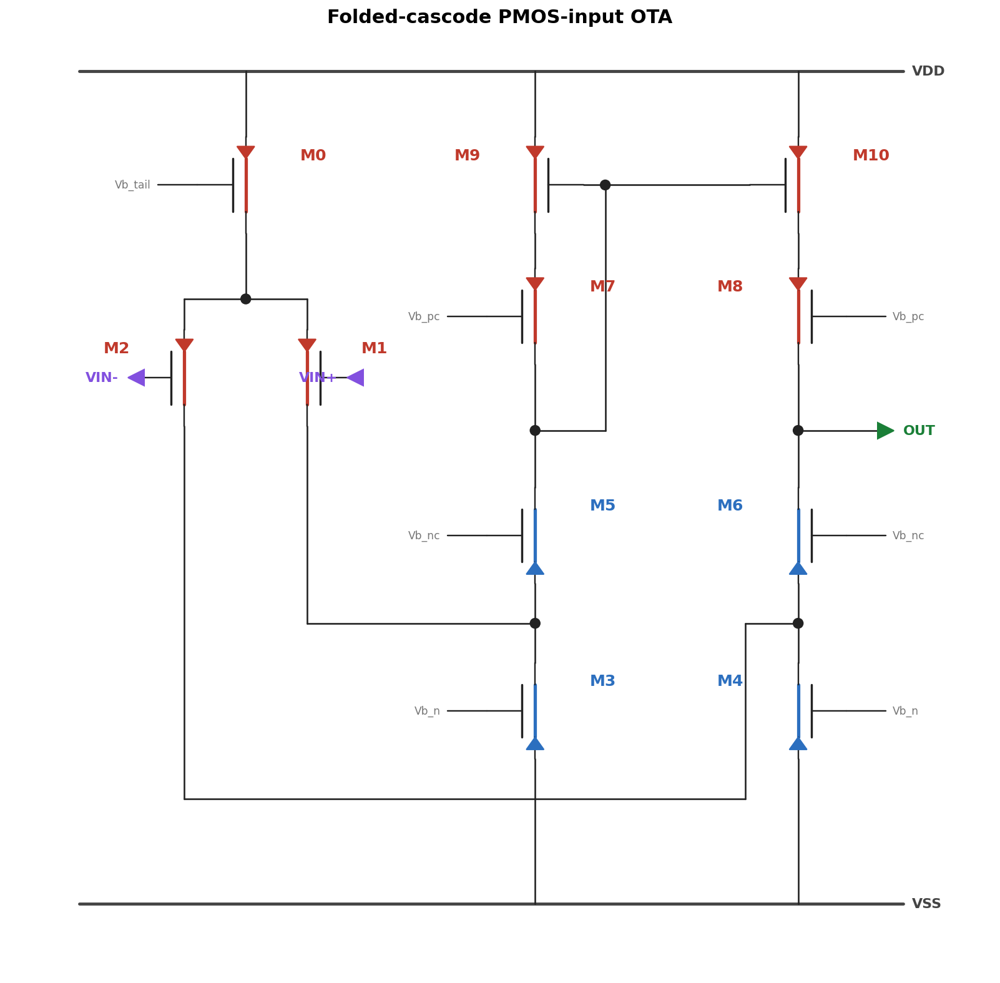

# Build a folded-cascode OTA in Cadence — programmatically

[`build_folded_cascode_ota.py`](build_folded_cascode_ota.py) constructs a
complete folded-cascode OTA schematic in Virtuoso with **virtuoso-bridge** — no
GUI clicking:

- places **11 MOS devices**,
- wires them purely by **net-label connectivity** (same net name → same node, no
  manual wires to route),
- sets per-device **W/L** through the CDF,
- drops the I/O and bias **pins**,
- runs **schematic check** and **saves** the cellview.



## Topology

A PMOS input pair (M1/M2) folded into an NMOS cascode, with a self-biased PMOS
cascode-mirror load (M9/M10 gates tie to the cascode node `nA2`). `OUT` is the
single-ended high-impedance node (`M8.drain = M6.drain`).

| block | devices |
|---|---|
| input / tail | M0 (tail), M1 (VIN+), M2 (VIN−) |
| col-1 (reference) | M9 (mirror) – M7 (pcasc) – M5 (ncasc) – M3 (sink) |
| col-2 (output) | M10 (mirror) – M8 (pcasc) – M6 (ncasc) – M4 (sink) |

Bias gates: `Vb_tail`, `Vb_pc`, `Vb_nc`, `Vb_n`.

## Run

1. Bring up a virtuoso-bridge session pointing at your Virtuoso (see the
   [repo README](../../../README.md)).
2. Edit the top of the script for **your PDK**: `DEV_LIB`, `PMOS`, `NMOS`, and
   the `SIZES` (the device-cell names shown are placeholders). Building the
   schematic needs **no PDK models** — only simulating it does.
3. ```bash
   python build_folded_cascode_ota.py
   ```

## Why net-label connectivity

The script never routes a single wire — every node is formed by giving two
terminals the **same net name**. This is the pattern that scales: a 200-device
block is the same code as an 11-device one, and the result stays diff-able
against a reference netlist.
